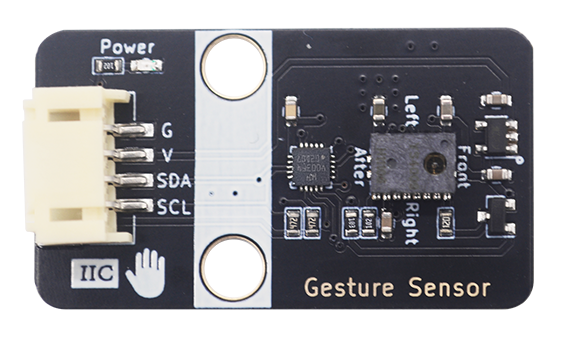

# GS20 Gesture Recognizer Sensor (YS4009)

## Introduction

The **GS20** is a high-performance, non-contact gesture recognition module powered by the advanced **YS4009 sensor**. Unlike traditional infrared sensors, the YS4009 contains image sensor, DSP processing, and MCU, utilizes a sophisticated image-based algorithm to provide superior stability and high-speed detection.



Capable of recognizing **8 distinct hand gestures**, the GS20 offers an intuitive touch-free interface for smart home systems, robotics, and interactive DIY projects. Its compact form factor and **I2C PH2.0 4-Pin interface** ensure seamless integration with Arduino, ESP32, and Raspberry Pi platforms.

## Key Features

* **Powered by YS4009:** High-precision CMOS imaging technology for accurate gesture tracking.
* **8 Gesture Support:** Detects Up, Down, Left, Right, Forward, Backward, Hover and Leave.
* **Plug-and-Play:** PH2.0 4-Pin connector prevents reverse polarity and simplifies wiring.
* **I2C Interface:** Standard I2C communication with a 3.3V/5V logic level shifter onboard, address 0x39.

## Technical Specifications

| Parameter | Specification |
| --- | --- |
| **Core Chip** | YS4009 |
| **Operating Voltage** | DC 5.0V |
| **Communication** | I2C (Address: 0x39) |
| **Sensing Distance** | 25 - 35 cm (10 - 14") |
| **Connector Type** | PH2.0 4-Pin |
| **Dimensions** | 22.4mm x 38.4mm |

## Hardware Overview & Pinout

| Pin | Name | Description |
| --- | --- | --- |
| 1 | **GND** | Ground |
| 2 | **VCC** | Power Supply (5V) |
| 3 | **SCL** | I2C Serial Clock Line |
| 4 | **SDA** | I2C Serial Data Line |

## Getting Started (Arduino Example)

### Hardware Connection

Connect the GS20 to your Arduino Uno R3 board using the following mapping:

| GS20 Module | Arduino Uno R3 |
| :---------: | :------------: |
|     GND     |      GND       |
|     VCC     |      VCC       |
|     SCL     |    SCL(A5)     |
|     SDA     |    SCA(A4)     |

### Library Installation

1. [Click here download the arduino library](https://docs.emakefun.com/zh-cn/ph2.0_sensors/smart_module/gesture_recognizer/emakefun_gesture_recognizer-latest.zip)

2. In the Arduino IDE, go to **Sketch** -> **Include Library** -> **Add .ZIP Library...** and select the downloaded .zip file.
3. [Click here to view descriptions of classes and interfaces](https://emakefun-arduino-library.github.io/emakefun_gesture_recognizer/classemakefun_1_1_gesture_recognizer.html)

### Example 

#### Arduino

```cpp
#include <Arduino.h>
#include <String.h>
#include <Wire.h>

// include
#include <gesture_recognizer.h>

namespace {
// create GestureRecognizer instance, I2C address 0x39 (GestureRecognizer::kDefaultI2cAddress)
emakefun::GestureRecognizer g_gesture_recognizer(emakefun::GestureRecognizer::kDefaultI2cAddress);
}  // namespace

void setup() {
  Serial.begin(115200);
  Serial.println("setup");
  Wire.begin();
  const auto ret = g_gesture_recognizer.Initialize(&Wire);
  if (ret == 0) {
    Serial.println(String(F("gesture recognizer initialization was successful")));
  } else {
    Serial.println(String(F("gesture recognizer initialization failed: ")) + ret);
    while (true);
  }
  Serial.println(F("setup was successful"));
}

void loop() {
  // get gesture 
  const auto gesture = g_gesture_recognizer.GetGesture();
  // If the gesture is not empty, print the value of the gesture.
  if (gesture != emakefun::GestureRecognizer::kGestureNone) {
    Serial.println(String(F("recognized gesture: ")) + gesture);
  }
}

```

#### Micropython

[Click here download the micropython library](https://github.com/nulllaborg/gesture-sensor/releases/download/v1.0.0/gesture_recognizer.zip)

```python
from gesture_recognizer import GestureRecognizer
import machine

print("setup")
gesture_recognizer = GestureRecognizer(i2c=machine.I2C(0, sda=21, scl=22),
                                       i2c_address=0x39)
print("version:", gesture_recognizer.version)
gesture_dict = {
    GestureRecognizer.GESTURE_NONE: "gesture none",
    GestureRecognizer.GESTURE_RIGHT_SWIPE: "gesture right swipe",
    GestureRecognizer.GESTURE_LEFT_SWIPE: "gesture left swipe",
    GestureRecognizer.GESTURE_BACKWARD_SWIPE: "gesture backward swipe",
    GestureRecognizer.GESTURE_FORWARD_SWIPE: "gesture forward swipe",
    GestureRecognizer.GESTURE_UPWARD: "gesture upward",
    GestureRecognizer.GESTURE_DOWNWARD: "gesture downward",
    GestureRecognizer.GESTURE_OUT_OF_RANGE: "gesture out of range",
    GestureRecognizer.GESTURE_HOVER: "gesture hover",
}

print("loop")
while True:
    gesture = gesture_recognizer.gesture
    if gesture is not GestureRecognizer.GESTURE_NONE:
        print(gesture_dict[gesture])
```

## Best Practices & Troubleshooting

* **Operating Range:** For best results, keep your hand about 25cm from the sensor.
* **Upward Gesture:** Hover at a low position for 200ms, then move upward within the sensing zone.
* **Downward Gesture:** Hover at a high position for 200ms, then move downward to trigger.
* **Power-on Setup:** Keep the sensor clear for 300ms after startup and install acrylic covers before powering on.

## Resources & Support

[Module 3D  file](./Gesture_Sensor_YS4009.step) 

[Module Dimensional Drawing](./Gesture_Sensor_YS4009-F_Fab.pdf)

